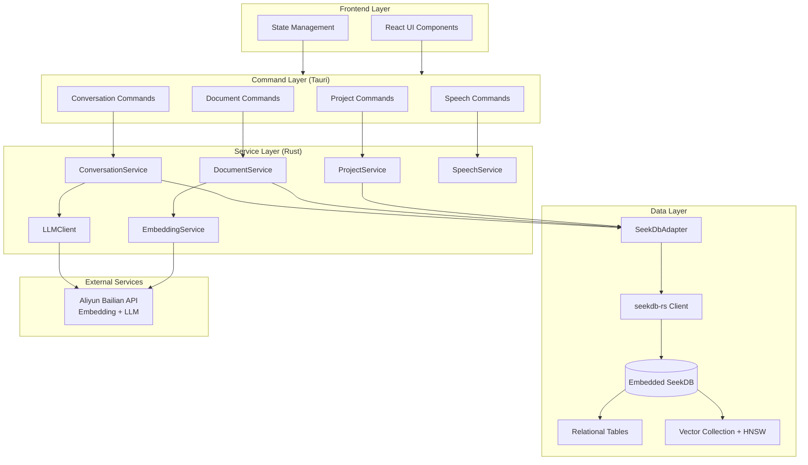

[](README.md)
[](README-ZH.md)


<sub>Logo Note: The "third eye" is often used in movies, novels, and anime as a symbol of supernatural abilities or awakening (e.g., Piccolo in Dragon Ball, prescience in Dune)</sub>


# MineKB - Personal Knowledge Base


A local knowledge base desktop application built on SeekDB.

## Overview

MineKB is a cross-platform desktop application built with Tauri, designed to help users efficiently manage and query their local document knowledge base.

### Core Features

- **Project Management**: Create multiple knowledge base projects, each containing multiple documents
- **Document Processing**: Upload documents in various formats (PDF, DOCX, etc.) with automatic vectorization
- **Batch Import**: Import documents from directories in bulk with intelligent pre-checks and automatic retry mechanisms
- **Intelligent Chat**: Interact with your knowledge base using natural language; AI generates accurate answers based on document content
- **Vector Search**: Leverage semantic search technology to quickly locate relevant document content
- **Streaming Output**: Real-time streaming display of AI-generated responses for a smooth user experience
- **Voice Interaction**: Voice input support for more convenient knowledge queries
- **Local Storage**: All data stored in a local embedded database, ensuring privacy and security

## Architecture

MineKB employs a RAG (Retrieval-Augmented Generation) architecture, combining vector retrieval and large language model technologies:

### Workflow

```
1. Document Upload → 2. Text Extraction → 3. Vectorization → 4. Store in Vector Database
                                                                        ↓
6. Stream Response ← 5. LLM Generates Answer ← Vector Retrieval ← User Query
```

### Technical Implementation

1. **Document Processing**
   - Text extraction from PDF, DOCX, and other document formats
   - Chunking of extracted text
   - Generation of document embeddings using Alibaba Cloud Bailian API

2. **Vector Storage**
   - [seekdb-rs](https://github.com/ob-labs/seekdb-rs) embedded vector database (Rust native, no Python)
   - Native support for vector types and HNSW indexing for efficient vector retrieval
   - Project-level data isolation and transaction support
   - Vector column output and database existence validation

3. **Intelligent Chat**
   - User queries are converted to vectors
   - Similarity search performed in the current project's vector database
   - Retrieved relevant document chunks are used as context, combined with the user query and sent to the LLM
   - The LLM generates accurate answers based on context and streams the response

4. **Speech Recognition**
   - Integrated speech recognition service supporting voice input queries
   - Automatic conversion of speech to text for processing

## 🛠️ Tech Stack

### Frontend

**Core Framework**
- **React 18.2.0** - Modern UI framework
- **TypeScript 5.2.2** - Type-safe development experience
- **Vite 5.0.8** - Fast build tool and development server

**Styling System**
- **Tailwind CSS 3.3.6** - Utility-first CSS framework
- **@tailwindcss/typography 0.5** - Markdown document typography
- **class-variance-authority 0.7** - Component style variant management
- **clsx 2.0 / tailwind-merge 2.0** - CSS class name merging utilities

**UI Component Library**
- **Radix UI** - Accessible component primitives
  - `@radix-ui/react-dialog 1.1.15` - Dialog component
  - `@radix-ui/react-alert-dialog 1.1.15` - Alert dialog
  - `@radix-ui/react-tabs 1.1.13` - Tabs component
  - `@radix-ui/react-dropdown-menu 2.1.16` - Dropdown menu
  - `@radix-ui/react-slot 1.2.3` - Slot component
- **Lucide React 0.294** - Beautiful icon library

**Content Rendering**
- **React Markdown 10.1** - Markdown rendering
- **React Syntax Highlighter 15.6** - Code syntax highlighting
- **remark-gfm 4.0** - GitHub Flavored Markdown support

**Development & Testing**
- **Vitest 1.0** - Fast unit testing framework
- **@testing-library/react 16.3** - React component testing
- **@testing-library/jest-dom 6.8** - DOM assertion library
- **@testing-library/user-event 14.6** - User event simulation
- **ESLint 8.55** - Code quality linting
- **TypeScript ESLint 6.14** - TypeScript code standards

### Backend

**Core Technologies**
- **Rust (Edition 2021)** - High-performance systems programming language
- **Tauri 1.5** - Lightweight cross-platform desktop application framework
  - `@tauri-apps/api 1.5` - Frontend API library
  - `@tauri-apps/cli 1.5` - Command-line tools
  - Enabled features: `path-all`, `http-all`, `dialog-all`, `fs-all`, `shell-open`

**Database**
- **seekdb-rs** (Rust) - AI-Native embedded vector database, no Python dependency
  - Native support for vector types and HNSW indexing
  - Hybrid search and full-text search support
  - High-performance vector similarity computation

### Rust Core Dependencies

**Document Processing**
- `pdf-extract 0.7` - PDF text extraction
- `docx-rs 0.4` - Word document processing

**Data Storage**
- `seekdb-rs` (Rust) - AI-Native embedded database with native vector indexing and HNSW retrieval, no Python

**Vector Computation**
- SeekDB native vector indexing (HNSW) - Efficient vector similarity search
- Rust standard library - Mathematical computations like cosine similarity (no third-party dependencies required)

**Network Communication**
- `reqwest 0.11` - HTTP client for AI API calls (supports json, stream, blocking)

**Serialization & Encoding**
- `serde 1.0` / `serde_json 1.0` - JSON serialization and deserialization
- `bincode 1.3` - Binary serialization for vector data
- `base64 0.22.1` - Base64 encoding/decoding (for voice data transmission)

**Speech Recognition**
- `hmac 0.12` - HMAC signature algorithm
- `sha1 0.10` / `sha2 0.10` - SHA hash algorithms
- `url 2.4` / `urlencoding 2.1` - URL encoding utilities

**System Utilities**
- `chrono 0.4` - Date and time handling (with serde support)
- `uuid 1.0` - Unique identifier generation (v4 + serde)
- `anyhow 1.0` / `thiserror 1.0` - Error handling
- `regex 1.0` - Regular expressions
- `walkdir 2.0` - Filesystem traversal

**Async Programming**
- `tokio 1.x` - Async runtime (full features)
- `futures 0.3` - Future combinators and utilities
- `async-stream 0.3` - Async stream macros (for streaming output)

**Logging**
- `log 0.4` - Logging facade
- `env_logger 0.10` - Environment variable-based logger implementation


### AI Services

- **Alibaba Cloud Bailian API** - For text embeddings and large language model conversations

## System Architecture

### Architecture Overview



- **Frontend**: React + TypeScript; state and UI.
- **Command Layer**: Tauri commands (project, document, conversation, speech) bridge frontend and Rust services.
- **Service Layer**: ProjectService, DocumentService, ConversationService, EmbeddingService, LLMClient, SpeechService.
- **Data Layer**: SeekDbAdapter uses **seekdb-rs** async Client to talk to embedded SeekDB (SQL + vector collection); no Python.
- **External**: Aliyun Bailian API for embeddings and LLM.

## Quick Start

### Requirements

**Build / development environment** (for local dev or packaging):

- Node.js 16+ (frontend and Tauri CLI)
- Rust 1.70+ (Tauri backend)
- No Python required (seekdb-rs is Rust-native)

### Install Dependencies

```bash
# Install frontend dependencies
npm install

# Rust dependencies are resolved at build time
```

### Configuration

1. Copy the configuration template:
```bash
cp src-tauri/config.example.json src-tauri/config.json
```

2. Edit `src-tauri/config.json` and fill in your Alibaba Cloud Bailian API credentials and other configuration

### Development Mode

```bash
# Start development server
tnpm run tauri:dev

# 自定义数据目录时可设置环境变量 CONFIG_DIR
CONFIG_DIR=/path/to/your/data tnpm run tauri:dev
```

### Build Application

```bash
# Build production version
tnpm run tauri:build
```

After building, the application will be located in the `src-tauri/target/release/bundle/` directory.

---

## Testing

```bash
# Run frontend tests
tnpm test

# Run test UI
tnpm run test:ui

# Run Rust tests
cd src-tauri && cargo test
```


### Why SeekDB?

- ✅ **Native Vector Support**: No serialization/deserialization overhead, 10-100x performance improvement
- ✅ **HNSW Indexing**: Professional vector indexing algorithm for faster and more accurate retrieval
- ✅ **AI-Native Features**: Built-in full-text search, hybrid search, and other AI capabilities
- ✅ **Better Scalability**: Supports larger datasets and more complex queries
- ✅ **seekdb-rs** (Rust): Embedded client, no Python dependency, vector column output and database validation

---

**MineKB** - Making Knowledge Management Smarter 🚀🚀🚀
